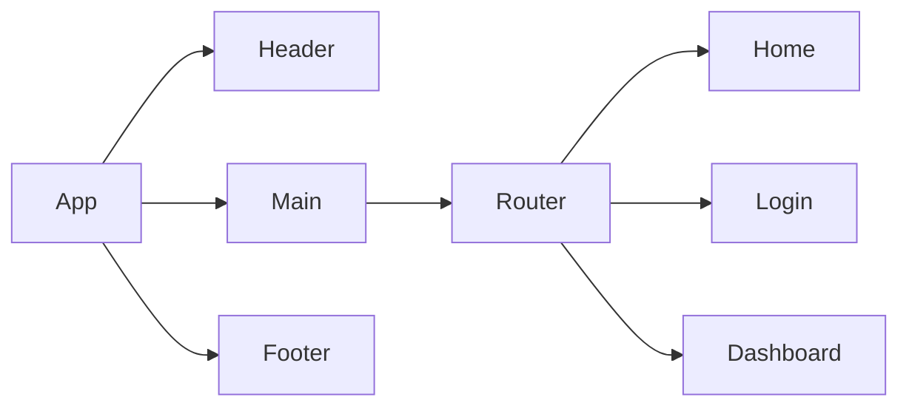

# Product Requirements Documentation

**Summary**
| Field | Detail |
|-------|--------|
| Project Name | {Put Project Name Here}|
| Description | {One sentence summarizing what is the app and why it matters} |
| Developers | {List of Developers} |
| Live Website | {website of deployed application} |
| Repo | {Link to git repository} |

## Problem Being Solved and Target Market

Use this area to explain what problem your app is solving, and who are the people who have this problem.

## User Stories

List of stories users should experience when using your application.

- Users should be able to see the site on desktop and mobile
- Users can create an account
- Users can sign in to their account
- Users can create a new item
- Users can see all their items on the dashboard
- Users can update items
- User can delete items

## Component Architecture

You can use the [Mermaid Markdown Syntax](https://mermaid-js.github.io/mermaid/#/flowchart) to create a chart of how the parts of your frontend website relate to each other. Units should represent components of your page. The following is an example you may see in a Single Page Application like a React App.

## User Interface Mockups

Use tooks like [Figma](https://www.figma.com/), [Mockflow](https://www.mockflow.com/) or [UXPIN](https://www.uxpin.com/). If you need inspiration visit a site like [Behance](https://www.behance.net/?tracking_source=typeahead_search_direct&search=web%20mockup). 

