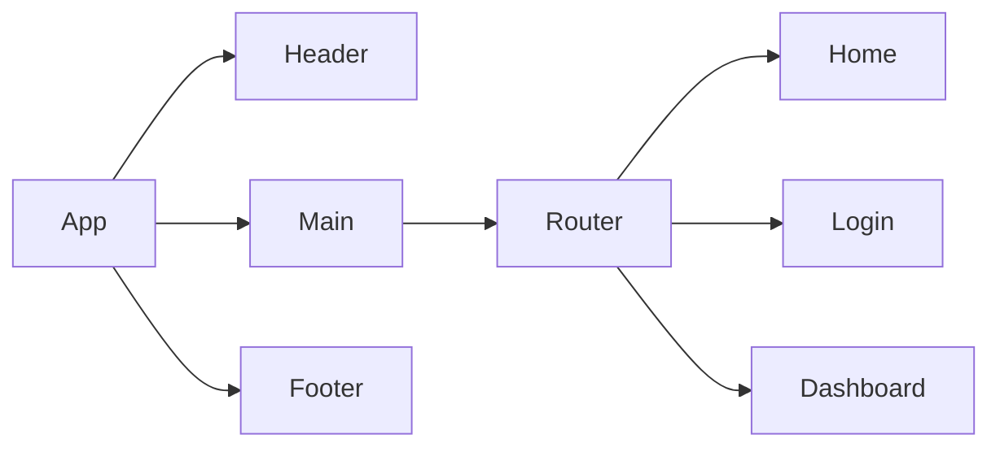

# Product Requirements Documentation

**Summary**
| Field | Detail |
|-------|--------|
| Project Name | I-Commerce Application|
| Description | {One sentence summarizing what is the app and why it matters} |
| Developers | Izzy Zinxhirija |
| Live Website |  |
| Repo | https://github.com/Izzy-2023/seir-seal-unit4-project4-frontend |

## Problem Being Solved and Target Market

The ecommerce app is a platform that enables users to browse, purchase, and manage products online. It offers a user-friendly interface for customers to view products, add them to a shopping cart, and securely complete transactions. The app also provides administrative tools for managing inventory, processing orders, and analyzing sales data,

## User Stories

List of stories users should experience when using your application.

- Users should be able to view the site on desktop and mobile
- Users can create an account
- Users can sign in to their account
- Users can checkout a product
- Users can create a product
- Users can see all their items on the dashboard
- Users can update their product information
- User can delete products from the cart 

## Component Architecture

You can use the [Mermaid Markdown Syntax]() to create a chart of how the parts of your frontend website relate to each other. Units should represent components of your page. The following is an example you may see in a Single Page Application like a React App.

## User Interface Mockups

Use tooks like [Figma](https://www.figma.com/), [Mockflow](https://www.mockflow.com/) or [UXPIN](https://www.uxpin.com/). If you need inspiration visit a site like [Behance](https://www.behance.net/?tracking_source=typeahead_search_direct&search=web%20mockup). 

