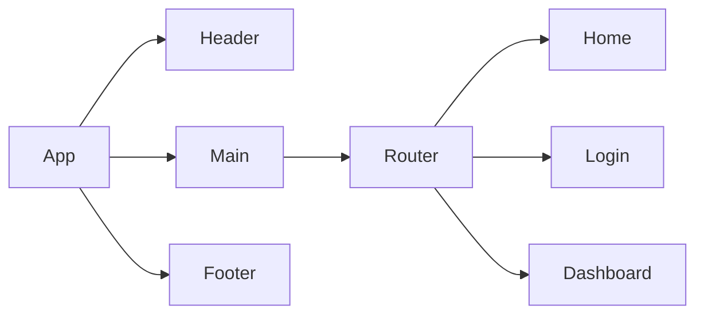

# Product Requirements Documentation

**Summary**
| Field | Detail |
|-------|--------|
| Project Name | Tech Consulting Application|
| Description | Tech consulting platform to browse for services and book appointments.  |
| Developers | Izzy Zinxhirija |
| Live Website |  |
| Repo | https://github.com/Izzy-2023/seir-seal-unit4-project4-frontend |

## Problem Being Solved and Target Market

The tech consulting website provides a platform for customers to explore and book various consulting services offered. Customers can browse through a list of services, view detailed descriptions, and book appointments for specific services. The website also includes user authentication for customers to manage their bookings and an admin dashboard for managing services and appointments.

## User Stories

List of stories users should experience when using your application.

- Users should be able to view the site on desktop and mobile
- Users can create an account
- Users can sign in to their account
- Users can buy a service
- Admin can create a service
- Admin can delete an appointment
- Users can see all their services on the dashboard
- Users can update their service information
- User can delete their service 
- User can book an appointment

## Component Architecture

## User Interface Mockups

### Main Page

### Services Page

### Login Page

